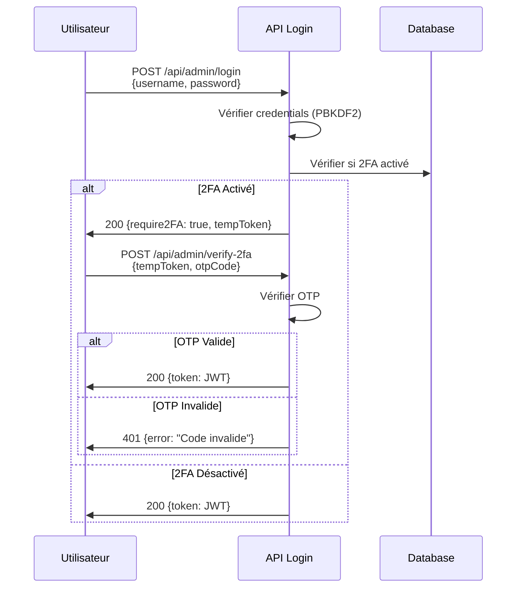

# Guide de Sécurité - Documentation 2FA Admin

## Authentification à Deux Facteurs (2FA) pour Admin

### Pourquoi 2FA ?
L'authentification à deux facteurs ajoute une couche de sécurité supplémentaire en exigeant :
1. **Quelque chose que vous savez** : Mot de passe admin
2. **Quelque chose que vous avez** : Code OTP généré par une app (Google Authenticator, Authy, etc.)

### Options d'Implémentation

#### Option 1 : TOTP avec `otplib` (Recommandé)
```bash
npm install otplib qrcode
```

**Avantages** :
- Standard TOTP (Time-based One-Time Password)
- Compatible avec Google Authenticator, Authy, etc.
- Pas de dépendance externe (fonctionne offline)

**Implémentation** :
1. Générer un secret unique pour l'admin au setup
2. Afficher un QR code à scanner
3. Valider le code OTP à chaque connexion

#### Option 2 : SMS avec Twilio
```bash
npm install twilio
```

**Avantages** :
- Facile pour l'utilisateur (reçoit SMS)
- Pas besoin d'app tierce

**Inconvénients** :
- Coût par SMS
- Dépendance réseau mobile
- Moins sécurisé que TOTP (SIM swapping)

#### Option 3 : Email avec Code
**Gratuit mais moins sécurisé**
- Envoyer code à 6 chiffres par email
- Valide pendant 5 minutes

### Recommandation : TOTP avec Recovery Codes

#### Étapes d'Implémentation

**1. Ajout des dépendances**
```json
{
  "dependencies": {
    "otplib": "^12.0.1",
    "qrcode": "^1.5.3"
  }
}
```

**2. Génération du secret (une seule fois)**
```typescript
import { authenticator } from 'otplib';

const secret = authenticator.generateSecret();
// Sauvegarder dans .env : ADMIN_2FA_SECRET=XXX
```

**3. Génération du QR Code**
```typescript
import QRCode from 'qrcode';

const otpauth = authenticator.keyuri(
  'admin@nubiaaura', 
  'NUBIA AURA', 
  secret
);

const qrCodeUrl = await QRCode.toDataURL(otpauth);
// Afficher ce QR code à l'admin pour qu'il le scanne
```

**4. Vérification du code OTP**
```typescript
import { authenticator } from 'otplib';

const isValid = authenticator.verify({
  token: userProvidedCode,
  secret: process.env.ADMIN_2FA_SECRET
});
```

**5. Codes de récupération (Backup)**
```typescript
const recoveryCodes = Array.from({ length: 10 }, () => 
  crypto.randomBytes(4).toString('hex').toUpperCase()
);

// Afficher une fois, sauvegarder hashés dans DB
// Format: XXXX-XXXX
```

### Flux de Connexion Admin avec 2FA



### Configuration Recommandée

**.env.example**
```bash
# 2FA Configuration
ADMIN_2FA_ENABLED=true
ADMIN_2FA_SECRET=your_totp_secret_here
```

**Variables d'environnement** :
- `ADMIN_2FA_ENABLED` : Activer/désactiver 2FA
- `ADMIN_2FA_SECRET` : Secret TOTP unique pour l'admin

### Routes API à Créer

1. **POST /api/admin/setup-2fa**
   - Génère secret + QR code
   - Retourne QR + recovery codes
   - Admin doit scanner et confirmer

2. **POST /api/admin/verify-2fa**
   - Vérifie le code OTP
   - Délivre le token JWT final

3. **POST /api/admin/disable-2fa**
   - Désactive 2FA (nécessite mot de passe + code OTP)

4. **POST /api/admin/use-recovery-code**
   - Utilise un code de récupération
   - Marque le code comme utilisé

### Sécurité Supplémentaire

1. **Rate Limiting** : Max 3 tentatives OTP par minute
2. **Window** : Accepter codes dans ±1 période (30s avant/après)
3. **Recovery Codes** : Hash avec SHA-256 avant stockage
4. **Logs** : Enregistrer toutes les tentatives 2FA

### Checklist d'Implémentation

- [ ] Installer `otplib` et `qrcode`
- [ ] Créer endpoint `/api/admin/setup-2fa`
- [ ] Créer endpoint `/api/admin/verify-2fa`
- [ ] Générer et sauvegarder secret 2FA
- [ ] Générer 10 recovery codes
- [ ] Ajouter champ DB pour codes de récupération
- [ ] Tester le flux complet
- [ ] Documenter pour l'admin

### Activation Initiale

```bash
# 1. Générer le secret
node scripts/generate-2fa-secret.js

# 2. Scanner le QR code avec Google Authenticator

# 3. Vérifier que ça fonctionne
# Entrer le code à 6 chiffres de l'app

# 4. Sauvegarder les recovery codes en lieu sûr
```

### En Cas de Perte de Téléphone

Utiliser un des 10 codes de récupération sauvegardés lors du setup initial.

**Important** : Chaque code de récupération ne peut être utilisé qu'une seule fois.

---

**Note** : Cette fonctionnalité est optionnelle mais **fortement recommandée** pour la production.
